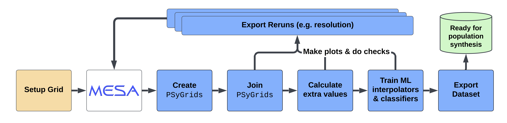

.. _workflow:

##################################
The POSYDON Workflow at a Glance
##################################

The purpose of this page is to give you a single, end-to-end mental model of how
POSYDON turns MESA simulations into a full synthetic population. Having this map
in mind makes every other page of the documentation easier to navigate.

.. note::

    If you are a new user you do **not** need to run every step of this loop.
    The :ref:`data releases <data-releases>` page describes fully processed
    grids, so you can jump straight to :ref:`running your first population
    <first-population>`. This page explains the machinery that produced those
    grids, so that you understand what the parts are for.

The pipeline, in one sentence
-----------------------------

POSYDON runs many detailed MESA simulations of single- and binary stars,
extracts and stores their essential properties in *grids*, trains fast
approximations (classifiers and interpolators) on the stored results, and
finally uses those approximations to evolve a large number of binaries quickly
enough to build and analyze a synthetic population.

Stage 1 — Build the MESA simulation grids
-----------------------------------------

MESA simulates the physical structure and evolution of single- and binary
stars. POSYDON provides a set of MESA inlists (stored in the
``POSYDON-MESA-INLISTS`` repository) for single stars and for binaries of
different kinds (e.g. hydrogen-rich stars in hydrogen-rich binaries, ``HMS-HMS``).
A *grid* is a collection of simulations spanning a range of initial conditions:
primary and secondary mass, orbital period, and stellar metallicity.

Running MESA is expensive, so it is generally done once on an HPC facility and
the results are shared with the community. See :ref:`grid-types` for the
different kinds of grids and how they parametrize the initial conditions, and
:ref:`MESA-grids <MESA-grids>` for how to run your own.

Stage 2 — Post-process the simulations
---------------------------------------

Raw MESA output is heavy and unwieldy for population simulation. POSYDON
extracts, for each simulation, the pieces that matter and stores them in the
compact container called a :ref:`PSyGrid <psygrid>`. This is the job of the
:ref:`processing pipeline <processing-pipeline>`.

For every MESA run, the pipeline keeps:

* **Initial values**: the starting conditions of the run.
* **Final values**: the ending conditions, including *termination flags* that
  say how the object stopped (e.g. reaching a supernova stage, or filling its
  Roche lobe).
* **Downsampled histories**: the evolution summarized at a reduced time
  resolution to save disk space.
* **Final profiles**: the interior structure of each star at the end of the
  run.

The results are grouped in a ``PSyGrid`` object ready for the next stage.

Stage 3 ---- Train the machine-learning surrogates
-----------------------------------------------------

Evolving every one of a large number of binaries during a live population run
with full MESA everywhere is infeasible. Instead, POSYDON fits fast surrogate
models on the grid results and uses them to step through a binary very quickly.
There are two complementary pieces, both described under
:ref:`machine learning <machine-learning>`:

* **Classifiers** decide the outcome of the various stages: whether an object
  fills its Roche lobe, whether a core-collapse supernova produces a black hole
  or a neutron star, and so on.
* **Interpolators** estimate the value of a property at an arbitrary point of
  the grid from its neighbours, rather than re-running the simulation.

The pipeline distinguishes *initial-final interpolators* (which map initial
conditions to final conditions) from *profile interpolators* (which reconstruct
the interior profile of a star). Profile interpolation is currently
experimental.

Stage 4 ---- Run the population synthesis
------------------------------------------

With the surrogates trained, a population simulator can evolve a large number of
binaries quickly, moving each one through a state machine (the "flow chart")
step by step. In the code, each star is a ``SingleStar``, each binary a
``BinaryStar``, a population a ``BinaryPopulation``, and the union of several
populations (e.g. one per metallicity) a ``SyntheticPopulation``. See
:ref:`stellar-binary-simulation` for the hierarchy of these objects. The
:ref:`Getting Started <first-grids>` pages and the :ref:`binary population
synthesis tutorial <binary-pop-syn>` go through this stage end to end.

Stage 5 ---- Analyze the synthetic population
-----------------------------------------------

The end product of a population run is a set of HDF5 files describing the
evolved binaries. They are loaded into a ``SyntheticPopulation``, then filtered,
selected, and analyzed - with the POSYDON analysis API or exported to Python
DataFrames. See :ref:`How to analyze a population <analyze-population>`.
Tasks such as computing merger rates, deriving observed luminosity functions,
and drawing Van den Heuvel diagrams are covered in the tutorials under (the
*Learn* section of the documentation).

Recapping the loop
--------------------

If you ever ask "which step is responsible for this piece?", remember the chain::

    MESA grids  ->  PSyGrid (post-processing)  ->  classifiers / interpolators
        ->  population synthesis  ->  SyntheticPopulation  ->  analysis
