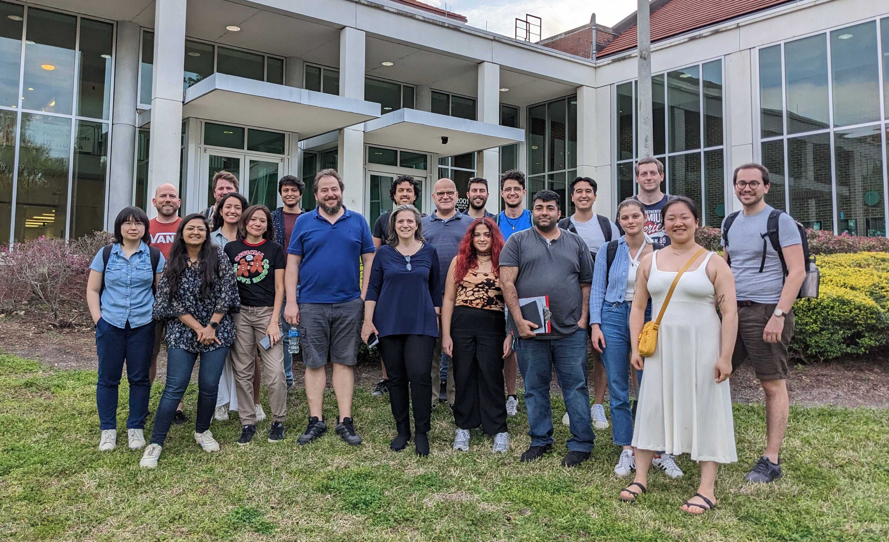

.. _team-page:

Collaborative Team
------------------

Our team consists of dedicated scientists and researchers, working together to shape and develop POSYDON. Here, we list all current members of the collaboration, with a special indicator for those who are part of the core development team. We also acknowledge and honor our past members for their contributions.

We're grateful to all our team members, both current and past, for their relentless efforts and dedication to the POSYDON project.

POSYDON Team, F2F meeting - University of Florida, February 2023

Current Team Members
~~~~~~~~~~~~~~~~~~~~

- **Jeff Andrews\***, *University of Florida*: Core developer focused on coordinating the development MESA grid simulations and the overall POSYDON structure.

- `Simone Bavera <https://www.unige.ch/sciences/astro/evolution/en/members/simone-bavera/>`_, *University of Geneva*: Leading the design and development of POSYDON since its conception. Simone uses POSYDON to study the formation mechanism of merging binary black holes, sources of gravitational waves.

- `Max M. Briel\* <http://maxbriel.com/>`_, *University of Geneva*.

- `Christopher Berry <https://cplberry.com/>`_, *University of Glasgow*.

- **Abhishek Chattaraj**, *University of Florida*.

- **Tassos Fragos (co-PI)**, *University of Geneva*.

- `Monica Gallegos-Garcia <https://mpgalleg.github.io/>`_, *Northwestern University*: Assisted with early planning for the infrastructure to generate MESA grids, running MESA simulations for POSYDON v2, and contributed to the analysis of compact object populations. Monica uses POSYDON to investigate the formation of compact object mergers.

- `Seth Gossage\* <https://sgossage.github.io/>`_, *Northwestern University*: Core developer focused on the development of MESA stellar evolution grids, especially for stars less massive than 10 solar masses. Seth employs POSYDON in his research to find constraints on the physics of stellar rotation, convection, and magnetic fields. 

- `Vicky Kalogera (co-PI) <https://sites.northwestern.edu/vickykalogera/>`_, *Northwestern University*.

- **Eirini Kasdagli**, *University of Florida*.

- `Aggelos Katsaggelos <https://www.mccormick.northwestern.edu/research-faculty/directory/profiles/katsaggelos-aggelos.html/>`_, *Northwestern University*.

- **Chase Kimball**, *Northwestern University*.

- `Dean Kousiounelos <https://cierareu.northwestern.edu/2023CIERA_REU_websites/DeanKousiounelos/index.html>`_, *Lake Forest College*: Developing data visualization for Binary Stellar Evolution for POSYDON to aid in understanding an evolutionary narrative, and bridge the gap between astrophysics and broader audiences. Under the mentorship of Dr. Vicky Kalogera and Dr. Seth Gossage.

- `Konstantinos Kovlakas <https://sites.google.com/view/kovlakas/>`_, *Institute of Space Sciences (ICE/CSIC,IEEC)*: Core developer responsible for core infrastructure, the encoding of MESA output in POSYDON, and the characterization of stars based on their properties. His research focuses on the modeling of accreting compact objects and comparisons against observations.  

- **Matthias Kruckow**, *University of Geneva*.

- **Shamal Lalvani**, *Northwestern University*.

- `Camille Liotine <https://sites.google.com/view/camilleliotine/home/>`_, *Northwestern University*: Integrating pulsar modeling into POSYDON and facilitating general code development for POSYDON.

- **Devina Misra**, *Norwegian University of Science and Technology*.

- **Kyle Rocha\***, *Northwestern University*: Development of the psy-cris active learning module, binary population API, evolutionary hooks, I/O for binary stars/populations, and integration with pandas DataFrame.

- `Jaime Román-Garza <https://www.researchgate.net/profile/Jaime-Roman-Garza/>`_, *University of Geneva*.

- **Philipp M. Srivastava\***, *Northwestern University*.

- `Meng Sun <https://sunmeng1118.wixsite.com/mysite/>`_, *Northwestern University*: Most of the contributions involved preparing detailed MESA binary modeling and assisting in the analysis of single-star and binary evolution results: reviewed the error distribution after MESA binary tracks were trained by the IFinterpolator; assisted in constructing MESA binary grids with metal-poor, metal-rich, and low-mass stars; and resolved code convergence issues.

- `Elizabeth Teng* <https://www.elizabethteng.space/>`_, *Northwestern University*: Developed stellar profile interpolation and consulted on time-series interpolation.

- `Goce Trajcevski <https://www.ece.iastate.edu/ece-directory/profile/gocet25//>`_, *Iowa State University*.

- `Zepei Xing <https://www.linkedin.com/in/zepei-xing-86ab10206//>`_, *University of Geneva*.

- `Manos Zapartas <https://www.unige.ch/sciences/astro/evolution/en/members/emmanouil-zapartas//>`_, *University of Geneva*.

.. note::
   Members marked with an asterisk (*) are part of the core development team.

Past Team Members
~~~~~~~~~~~~~~~~~

- `Aaron Dotter <https://github.com/aarondotter/>`_, *Northwestern University*.

- `Prabin Giri <https://www.linkedin.com/in/prabin-giri/?challengeId=AQFEozgoG2y_cAAAAYr5ym0px752T8Sw16L9s-yAc2fx03-CJQPr7R7rXL5sJIUwruTaPz8M6a-dkBgtBRuZeKTPDDGpUSC3nQ&submissionId=127c83ea-00da-8a17-8368-486816a84b65&challengeSource=AgH-aHskQ5MS8QAAAYr5yqOjOaDpfWA48ZiNg5S2_HuU9rRjN3Xm0Fm8hGytTBE&challegeType=AgG2MJyo8ejfEAAAAYr5yqOl85PCIJetx9JnjJYguICw_0MHIBbQcKU&memberId=AgGZznNewh3mGQAAAYr5yqOo__zh8fhzgpEgYAS0qRTji74&recognizeDevice=AgFC0wH5NdC7ewAAAYr5yqOrHm2rppDPcVIyGFuVwJmWVAnmpBiN/>`_, *Iowa State University*.

- **Ying Qin**, *Formerly, Northwestern University*: Contributed to the v1 development of MESA grids. Ying used POSYDON for his postdoctoral research to study X-ray binaries.

- `Juan Gabriel Serra Perez <https://ciera.northwestern.edu/directory/juan-gabriel-serra-perez//>`_,	*Northwestern University*.

- `Xu Teng <https://www.linkedin.com/in/xuteng123//>`_, *Iowa State University*.

- **Nam Tran**, *Formerly, University of Copenhagen*: Assisted early development of the POSYDON core infrastructure. Nam used POSYDON in his master thesis to study X-ray binaries.

Students Contributions
~~~~~~~~~~~~~~~~~~~~~~

- `Petter Stahle <https://www.linkedin.com/in/petter-stahle/>`_, *Formerly, University of Geneva*: Developed the POSYDON web-application API interface to run POSYDON v1 population synthesis simulations.

