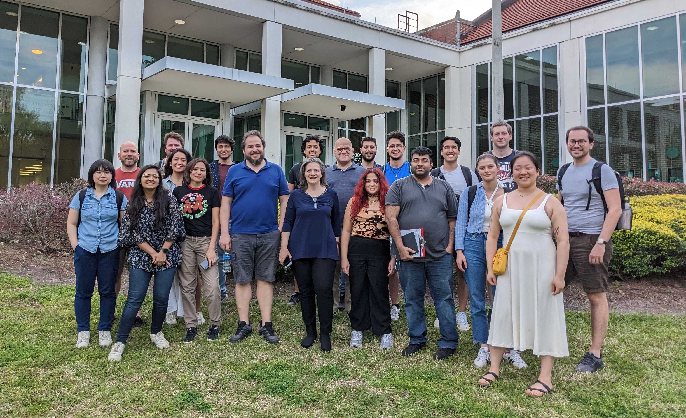

.. _team-page:

Collaborative Team
------------------

Our team consists of dedicated scientists and researchers, working together to shape and develop POSYDON. Here, we list all current members of the collaboration, with a special indicator for those who are part of the core development team. We also acknowledge and honor our past members for their contributions.

We're grateful to all our team members, both current and past, for their relentless efforts and dedication to the POSYDON project.

POSYDON Team, F2F meeting - University of Florida, February 2023

Current Team Members
~~~~~~~~~~~~~~~~~~~~

- `Dr. Simone Bavera* <https://www.unige.ch/sciences/astro/evolution/en/members/simone-bavera/>`_, *University of Geneva*: Leading the design and development of POSYDON since its conseption. Simone uses POSYDON to study the formation mechanism of merging binary black holes, sources of gravitational waves.
  
- Dr. Jeff Answers*, *University of Florida*: Core developer focused on coordinating the development MESA grid simulations and the overall POSYDON structure. Jeff employs POSYDON in his research to stuy ...

- Prof. Tassos Fragos*, *University of Geneva*: TODO

- Prof. Vicky Kalogera, *Northwestern University*: TODO

(Continue listing all past team members...)

.. note::
   Members marked with an asterisk (*) are part of the core development team.

Past Team Members
~~~~~~~~~~~~~~~~~

- Dr. Ying Qin, *University of XYZ*: Contributed to the v1 development of MESA grids. Ying used POSYDON for his post-doctoral research to study X-ray binaries.

- Nam Tran, *Formerly, University of Copenhagen*: Assisted early development of the POSYDON core infrastructure. Nam used POSYDON in his master thesis to study X-ray binaries.

(Continue listing all past team members...)

Students Contributions
~~~~~~~~~~~~~~~~~~~~~~

- Petter Stahle, *Formerly, University of Geneva*: Developed the POSYDON web-application API interphase to run POSYDON v1 population synthesis simulations. 

(Continue listing all past team members...)

