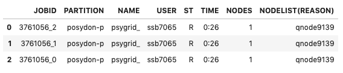

.. _PSyGrid:

###############################
The PSyGrid Object
###############################

The PSyGrid class is the "bridge" connecting MESA and POSYDON. It:

- encapsulates the data from a MESA grid in a compact form
- saves the data in an HDF5 file
- allows the user to access the data in a memory-efficient way

To use PSyGrid import it using:

.. code-block:: python

  from posydon.grids.psygrid import PSyGrid

Creating a PSyGrid object
=========================

A PSyGrid HDF5 file can be created by using the ``create()`` method on a newly
constructed PSyGrid object.

Basic example
-------------
The simplest method is to provide the paths of the folder of the MESA runs
output, and the HDF5 file to be created.

.. code-block:: python

  grid = PSyGrid()
  grid.create(MESA_runs_directory, psygrid_hdf5_path)

Now, the PSyGrid object is ready to be used for accessing and plotting data.

Output options
--------------
Use the option ``verbose`` to see more details while the PSyGrid object is
being built.

Set ``overwrite`` to ``True`` if the HDF5 file already exists.

By default, any warnings produced are collected and shown at the end
(``warn="end"``) of the process. Use ``warn="normal"`` to see the warning
when they occur, or ``warn="suppress"`` to hide them completely.

.. code-block:: python

  grid = PSyGrid()
  grid.create(MESA_runs_directory, psygrid_hdf5_path,
              verbose=True, overwrite=True, warn="suppress")

Setting the properties of the grid
----------------------------------
PSyGrid provides a compact form of the initial MESA grid. To define how many runs should be included (e.g. for testing purposes),
and which data columns are needed, use the following code block as a guide.

.. code-block:: python

  DEFAULT_BINARY_HISTORY_COLS = ['star_1_mass', 'star_2_mass', 'period_days', 'binary_separation', 'age', 'rl_relative_overflow_1', 'rl_relative_overflow_2', 'lg_mtransfer_rate']
  DEFAULT_STAR_HISTORY_COLS = ['star_age', 'star_mass', 'he_core_mass', 'c_core_mass', 'center_h1', 'center_he4', 'c12_c12', 'center_c12', 'log_LH', 'log_LHe', 'log_LZ', 'log_Lnuc', 'surface_h1', 'log_Teff', 'log_L']
  DEFAULT_PROFILE_COLS = ['radius', 'mass', 'logRho', 'omega']

  GRIDPROPERTIES = {
      # file loading parameters
      "description": "",                      # description text
      "max_number_of_runs": None,
      "format": "hdf5",
      # resampling parameters
      "n_downsample_history": None,           # False/None = no hist. resampling
      "n_downsample_profile": None,           # False/None = no prof. resampling
      "history_resample_columns": DEFAULT_HISTORY_DOWNSAMPLE_COLS,
      "profile_resample_columns": DEFAULT_PROFILE_DOWNSAMPLE_COLS,
      # columns to pass to the grid
      "star1_history_saved_columns": DEFAULT_STAR_HISTORY_COLS,
      "star2_history_saved_columns": DEFAULT_STAR_HISTORY_COLS,
      "binary_history_saved_columns": DEFAULT_BINARY_HISTORY_COLS,
      "star1_profile_saved_columns": DEFAULT_PROFILE_COLS,
      "star2_profile_saved_columns": DEFAULT_PROFILE_COLS,
      # Initial/Final value arrays
      "initial_value_columns": None,
      "final_value_columns": None,
  }

  grid = PSyGrid()
  grid.create(MESA_runs_directory, psygrid_path, **GRIDPROPERTIES)

Loading an existing PSyGrid object
==================================

To load a PSyGrid object from an HDF5 file you only need its path:

.. code-block:: python

  grid = PSyGrid('/home/mydata/my_MESA_grid')

Closing/deleting a PSyGrid object
==================================
As with files in Python, it is preferable to "close" PSyGrid objects after
handling them.

The ``.close()`` method closes the HDF5 file associated to the PSyGrid object.
However, the object continues to exist and hold all the metadata.

.. code-block:: python

  grid.close()

In the case that a PSyGrid object is not needed anymore,
use the ``del`` keyword. Note that this also closes the HDF5 file.

.. code-block:: python

  del grid

Grid engineering (advanced use case scenario)
=============================================

When confronted with a large parameter space to cover, we advise that the
parameter space be split into multiple directories for separate grid slices,
composed of a few thousand runs each. These separate grids can be combined
together afterwards.

Here we preset an advanced use of the ``PSyGrid`` object meant to be used on a
HPC facility with Slurm. Our experience is that grid manipulation is most
easily performed with a Jupyter notebook using Slurm magic commands which can
be installed with

.. code-block:: python

  !pip install git+https://github.com/NERSC/slurm-magic.git

directly from the Jupyter notebook.

Here we illustrate how to post process an example HMS-HMS grid composed of
three slices at fixed mass ratios of 0.50, 0.70, and 0.90.

Creating grid slices
--------------------

The following script allows to post process the raw MESA data into a ``PSyGrid``
object either in its ``ORIGINAL`` form (without any downsampling) or to use
the ``LITE`` downsampling presented in Fragos et al. (2022).

.. code-block:: python

  %%writefile create_individual_psygrid_files.py
  import os
  import sys
  import numpy as np
  from posydon.grids.psygrid import (PSyGrid, DEFAULT_HISTORY_DS_EXCLUDE,
                                     DEFAULT_PROFILE_DS_EXCLUDE,
                                     EXTRA_COLS_DS_EXCLUDE)

  if __name__ == "__main__":

      # directory with MESA data
      path = '/working_dir/'

      # MESA grid slices to post process
      grid_names = ['grid_q_0.50','grid_q_0.70','grid_q_0.90']

      # choose grid slice
      i = int(sys.argv[1])
      print('Job array index:',i)
      grid_name = grid_names[i]

      # choose the compression
      grid_type = str(sys.argv[2])
      if grid_type == 'ORIGINAL':
          history_DS_error = None
          profile_DS_error = None
          history_DS_exclude = DEFAULT_HISTORY_DS_EXCLUDE
          profile_DS_exclude = DEFAULT_PROFILE_DS_EXCLUDE
      elif grid_type == 'LITE':
          history_DS_error = 0.1
          profile_DS_error = 0.1
          history_DS_exclude = EXTRA_COLS_DS_EXCLUDE
          profile_DS_exclude = EXTRA_COLS_DS_EXCLUDE
      else:
          raise ValueError('grid_type = %s not supported!'%grid_type)

      print('Creating psygrid for',grid_name, '...')
      grid = PSyGrid(verbose=True)
      grid.create(path+"%s"%grid_name,
                  "./"+grid_type+"/%s.h5"%grid_name,
                  overwrite=True, history_DS_error=history_DS_error,
                  profile_DS_error=profile_DS_error,
                  history_DS_exclude=history_DS_exclude,
                  profile_DS_exclude=profile_DS_exclude,
                  compression="gzip9", start_at_RLO=False,
                 )

The script above creates a script with the name
``create_individual_psygrid_files.py`` which we can run with the following
Slurm magic command.
IMPORTANT: we will run the script with both options compressions options
LITE and ORIGINAL. The uncompressed version of the grid will be used in a later
step
Before running the script we need to create a ``logs`` directory where we will
store Slurm output messages, and two directories where we will store the two
different ``PSyGrid`` object outputs, i.e. ``ORIGINAL`` and ``LITE``.
Once the post processing of the data is complete, we will be notified by email
from Slurm.

.. code-block:: python

  %%sbatch
  #!/bin/bash
  #SBATCH --mail-type=ALL
  #SBATCH --mail-user=my_email
  #SBATCH --account=b1119
  #SBATCH --partition=posydon-priority
  #SBATCH --array=0-2
  #SBATCH --ntasks-per-node 1
  #SBATCH --mem-per-cpu=8G
  #SBATCH --time=24:00:00
  #SBATCH --job-name="psygrid"
  #SBATCH --output=/working_dir/grid_%a.out

  srun python /working_dir/create_individual_psygrid_files.py $SLURM_ARRAY_TASK_ID LITE

The above code cell will return the Slurm job id which we can use to verify that
our script is working correctly. In this specific example each grid slice is
composed by 2800 MESA HMS-HMS simulations. The post processing
will take roughly one hour per grid slice.

.. code-block:: python

  %squeue -j 3761056

Rerun subsample of grid slices
------------------------------

Because of convergence issues, a non-negligible fraction of the MESA
simulations did not converge. The grid architect would now like to rerun the
subsample of the grid with convergence problem changing one or more MESA inlist
flags. This can be easily done with the ``.rerun()`` method.

.. code-block:: python

  grid = PSyGrid('/working_dir/LITE/grid_0.70.h5')
  grid.rerun('/working_dir/grid_0.70_rerun/',
             termination_flags=['min_timestep_limit','reach cluster timelimit'],
             new_mesa_flag={'opacity_max':0.5})
  grid.close()

The above script loads the LITE version of the ``PSyGrid`` object
``grid_q_0.70.h5``, generates a new ``grid.csv`` file containing the initial
points runs with given ``termination_flags`` (see TF1 of plot2D documentation)
and additional columns corresponding to the new MESA flags specified in the
dictionary ``new_mesa_flag``, e.g. limiting the opacity maximal value of a star.

Alternatively, the grid architect might care to select a subsample of the MESA
runs with some user defined logic, e.g. to generate a patch of the grid which
addresses a change that affect a portion of the parameter space to rerun with a
new MESA inlist commit (see running MESA documentation). This can be specified
with the ``runs_to_rerun`` option of the ``.rerun`` method which expects a list
of indices of tracks to rerun.

Combine grid slices
-------------------

Let assume that we now have the three original grid slices
(``grid_q_0.50.h5,grid_q_0.70.h5,grid_q_0.90.h5``),
three additional reruns of them addressing convergence issues
(``grid_q_0.50_rerun.h5,grid_q_0.70_rerun.h5,grid_q_0.90_rerun.h5``),
and a grid slice extension which cover wider larger orbital periods not covered
in the main grids (``grid_p_extension.h5``) which we want to combine in a
single file.

The function ``join_grids`` does exactly this for us taking care of replacing
older runs with newer one. The grid layering follows the list order,
namely the last grid will be layered last.
Here is how we can combine the grid slices

.. code-block:: python

  %%writefile combine_grid_slices.py
  import os
  import sys
  import numpy as np
  from posydon.grids.psygrid import PSyGrid, join_grids

  if __name__ == "__main__":

      # choose the compression
      grid_type = str(sys.argv[1])

      path = '/working_dir/'+grid_type+'/'

      # grid slices to combine
      grid_names = ['grid_q_0.50.h5','grid_q_0.70.h5','grid_q_0.90.h5',
                    'grid_q_0.50_rerun.h5','grid_q_0.70_rerun.h5',
                    'grid_q_0.90_rerun.h5','grid_p_extension.h5'
                   ]
      grid_paths = [path+name for name in grid_names]

      print('Combining the grids:')
      print(grid_paths)
      print('')
      join_grids(grid_paths,path+'grid_combined.h5')
      print('DONE!')

The above script is run for both grid compressions ``LITE`` and ``ORIGINAL``
with the following cell.

.. code-block:: python

  %%sbatch
  #!/bin/bash
  #SBATCH --mail-type=ALL
  #SBATCH --mail-user=my_email
  #SBATCH --account=b1119
  #SBATCH --partition=posydon-priority
  #SBATCH --ntasks-per-node 1
  #SBATCH --mem-per-cpu=8G
  #SBATCH --time=24:00:00
  #SBATCH --job-name="psygrid"
  #SBATCH --output=/working_dir/logs/combine_grid_slices.out

  srun python /working_dir/combine_grid_slices.py LITE

Add post process quantities
---------------------------

There is a list of quantities that ``POSYDON`` requires to be precomputed
on the original grids. These quantities include, e.g., core-collapse
and common envelope properties.

.. code-block:: python

  %%writefile post_process_grid.py
  import os
  import sys
  from shutil import copyfile
  import numpy as np
  import pickle
  from posydon.grids.psygrid import PSyGrid
  from posydon.grids.post_processing import post_process_grid, add_post_processed_quantities

  if __name__ == "__main__":

      path = '/working_dir/'

      # chose the grid given the job_array index
      grid_name = 'grid_combined.h5'
      grid_name_processed = 'grid_combined_processed.h5'
      columns_name = 'post_processed_EXTRA_COLUMNS.pkl'
      dirs_name = 'post_processed_MESA_dirs.txt'

      # copy file, it will be overwritten when we add columns
      if os.path.exists(path+'ORIGINAL/'+grid_name_processed):
          print('Post processed grid file alredy exist, removing it...')
          os.remove(path+'ORIGINAL/'+grid_name_processed)
      copyfile(path+'ORIGINAL/'+grid_name, path+'ORIGINAL/'+grid_name_processed)

      grid_ORIGINAL = PSyGrid(path+'ORIGINAL/'+grid_name_processed)
      MESA_dirs_EXTRA_COLUMNS, EXTRA_COLUMNS = post_process_grid(grid_ORIGINAL,
                                    index=None, star_2_CO=False, verbose=False)

      # save processed quantities
      if os.path.exists(path+'ORIGINAL/'+columns_name):
          print('EXTRA COLUMNS file alredy exist, removing it...')
          os.remove(path+'ORIGINAL/'+columns_name)
      with open(path+'ORIGINAL/'+columns_name, 'wb') as handle:
          pickle.dump(EXTRA_COLUMNS, handle, protocol=pickle.HIGHEST_PROTOCOL)
      if os.path.exists(path+'ORIGINAL/'+dirs_name):
          print('MESA dirs file alredy exist, removing it...')
          os.remove(path+'ORIGINAL/'+dirs_name)
      with open(path+'ORIGINAL/'+dirs_name, 'w') as filehandle:
          for listitem in MESA_dirs_EXTRA_COLUMNS:
              filehandle.write('%s\n'%listitem)

      print('Add post porcessed columns to ORIGIN grid...')
      add_post_processed_quantities(grid_ORIGINAL, MESA_dirs_EXTRA_COLUMNS,
                                    EXTRA_COLUMNS, verbose=False)
      grid_ORIGINAL.close()

      # copy file, it will be overwritten when we add columns
      if os.path.exists(path+'LITE/'+grid_name_processed):
          print('Post processed grid file alredy exist, removing it...')
          os.remove(path+'LITE/'+grid_name_processed)
      copyfile(path+'LITE/'+grid_name, path+'LITE/'+grid_name_processed)

      grid_LITE = PSyGrid(path+'LITE/'+grid_name_processed)
      print('Add post porcessed columns to LITE grid...')
      add_post_processed_quantities(grid_LITE, MESA_dirs_EXTRA_COLUMNS,
                                    EXTRA_COLUMNS, verbose=False)
      grid_LITE.close()
      print('Done!')

The script can be run with the following Slurm magic commad.

.. code-block:: python

  %%sbatch
  #!/bin/bash
  #SBATCH --mail-type=ALL
  #SBATCH --mail-user=my_email
  #SBATCH --account=b1119
  #SBATCH --partition=posydon-priority
  #SBATCH --ntasks-per-node 1
  #SBATCH --mem-per-cpu=8G
  #SBATCH --time=24:00:00
  #SBATCH --job-name="psygrid"
  #SBATCH --output=/working_dir/logs/post_process_grid.out

  export PATH_TO_POSYDON=/add_your_path/
  srun python /working_dir/post_process_grid.py

Splitting the grid into chunks
------------------------------

Some data sharing services limit the file size. E.g. ``git-lfs`` limits
the maximum file size to be around 2 GB. The following script splits the
post processed grid into chunks of files of 2 GB size.

.. code-block:: python

  %%writefile split_grid.py
  import os
  import numpy as np
  from posydon.grids.psygrid import PSyGrid, join_grids

  if __name__ == "__main__":

        path = '/working_dir/'

        git_lfs_dir = 'git-lfs_data_format'

        files = os.listdir(path+git_lfs_dir)
        if files:
            print('Remove old grid in git_lfs_dir ...')
            for file in files:
                if '.h5' in file:
                    os.remove(path+git_lfs_dir+file)

        grid_names = [path+'LITE/grid_combined_processed.h5']
        print('')
        join_grids(grid_names,path+git_lfs_dir+'/grid_%d.h5')
        print('DONE!')

The above script can be run with the following Slurm magic command.

.. code-block:: python

  %%sbatch
  #!/bin/bash
  #SBATCH --mail-type=ALL
  #SBATCH --mail-user=my_email
  #SBATCH --account=b1119
  #SBATCH --partition=posydon-priority
  #SBATCH --ntasks-per-node 1
  #SBATCH --mem-per-cpu=8G
  #SBATCH --time=24:00:00
  #SBATCH --job-name="psygrid"
  #SBATCH --output=/working_dir/logs/split_grid.out

  srun python /working_dir/split_grid.py

The split grid can be loaded into a ``PSyGrid`` object with the follow line.

.. code-block:: python

  grid = PSyGrid('/working_dir/git-lfs_data_format/grid_%d.h5')
