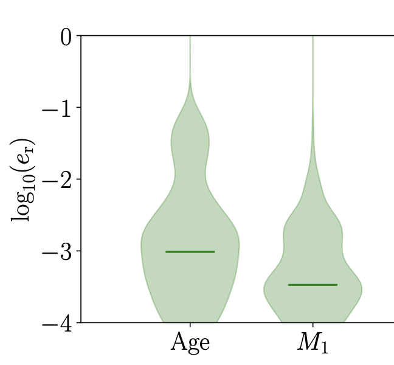
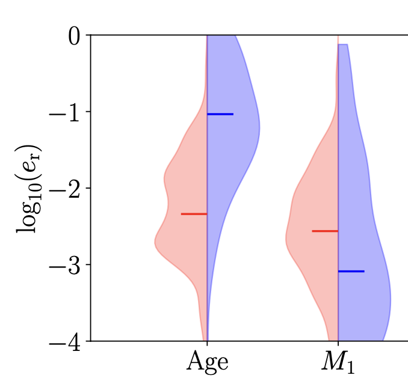

.. _violinplot:

######################
Making the Violin Plot
######################

To make the violin plot, edits in the code are needed to make the code print the interpolation errors for the quantities. Go to the file IF_interpolation.py with your preferred code editor

.. code-block::

    your_path_to_the_POSYDON_top_directory/posydon/interpolation/IF_interpolation.py
    

Code for making POSYDON printing interpolation errors
=====================================================

To avoid training the data with different algorithms again, we use the interpolator directly for saving computational time. Here we show an example of asking the code to print out the errors when using linear3c interpolation with the kNN (K-Nearest Neighbor algorithm) classification method. In the IF_interpolation.py, please comment the lines below to make the code skip other algorithms (e.g. 1st-Nearest Neighbor).Code for making POSYDON printing interpolation errors

.. code-block::

    #interp_method, class_method = "linear", "kNN"
    #mlin = IFInterpolator(grid=grid_T, interp_method=interp_method,class_method=class_method)
    #name = "IF_" + dat + '_' + interp_method + "_" + class_method + ".pkl"
    #mlin.save(os.path.join(path2obj, name))

    #interp_method, class_method = "1NN", "1NN"
    #m1NN = IFInterpolator(grid=grid_T, interp_method=interp_method,class_method=class_method)
    #name = "IF_" + dat + '_' + interp_method + "_" + class_method + ".pkl"
    #m1NN.save(os.path.join(path2obj, name))

    
Instead of training the grid again, the next step is to give the path of the interpolator at mMC and change the interpolation method as linear3c.

.. code-block::

    #mMC = IFInterpolator(grid=grid_T, interp_method=interp_method,class_method=class_method, interp_classes=classes)
    mMC = IFInterpolator(filename = 'your_path_to_the_interpolator')
    interp_method = "linear3c"

And make sure only one algorithm is used for interpolation and classification to save time.

.. code-block::

    #assess_models([m1NN, mlin, mMC], grid_T, grid_t, ux2, path=path2figs)
    assess_models([mMC], grid_T, grid_t, ux2, path=path2figs)
    
Another chunk of code that could be commented out to save computational time is shown below

.. code-block::

    ## Assess classification results
    #print("\n\n#### Classification ######################################")

    #for key in models[0].classifiers:
        #print(f"\n   Classification for [{key}]:")
        #if models[0].classifiers[key] is not None:
            #for c in uic:
                #f = grid_T.final_values['interpolation_class'] == c
                #print(f"\t{c}: [{np.sum(grid_T.final_values[key][f] == 'None')}/{np.sum(f)}] NaNs")

            ## Ground Truth
            #zt_gt = grid_t.final_values[key][validt >= 0]
            ## Confusion Matrices
            #for i, m in enumerate(models):
                #print(f"\n\t  {m.classifiers[key].method}")
                #bas = balanced_accuracy_score(zt_gt, Ztpred[i][key])
                #print(f"\t  Balanced Accuracy Score: {100 * bas:.3f}")
                #oa = np.sum(Ztpred[i][key] == zt_gt) / len(zt_gt)
                #print(f"\t  Overall Accuracy: {100 * oa:.3f}")
                #CM = confusion_matrix(zt_gt, Ztpred[i][key], m.classifiers[key].labels)
                #savename = os.path.join(path2prmaps, key + '_' + class_methods[i] + '.png')
                #fig, ax = plot_conf_matrix(100 * CM, m.classifiers[key].method, key, m.classifiers[key].labels,savename=savename)
                #plt.close(fig)

                #ZT = grid_T.final_values[key][m.valid >= 0]
                #zt_gt = grid_t.final_values[key][validt >= 0]
                #fig, ax = plot_mc_classifier(m, key, m.XT[m.valid >= 0, :], ZT, ux2, Xt=Xt[validt >= 0], zt=zt_gt,zt_pred=Ztpred[i][key], path=path2prmaps)
        #else:
            #print(f"\tNaN")

Printing out the errors on-screen for desired physical quantities
=================================================================
To access the value of the errors, the below code should be implemented in "Assess interpolation results".

.. code-block::

    Ygt = Yt[validt >= 0, :] # this line is from the original IF_interpolation.py, using for indicating where to start the new code
    
    Xgt = Xt[validt >= 0, :]
    mask = grid_t.final_values['interpolation_class'][validt >= 0] == 'stable_MT'
    mask2 = grid_t.final_values['interpolation_class'][validt >= 0] == 'unstable_MT'
    mask3 = grid_t.final_values['interpolation_class'][validt >= 0] == 'no_MT'

The above code is to compute a mask which is an array of booleans with true in the places where the evolutionary track has stable mass transfer/unstable mass transfer/no mass transfer.

In the loop under the definition of the list err_r and err_a, the new code below should be implemented. Here we show an example of printing the error for system age and the star 1 mass.

.. code-block::

        err_a.append(np.abs(Ytpred[i] - Ygt)) # this line is from the original IF_interpolation.py, using for indicating where to start the new code
        err_r.append(err_a[i] / (np.abs(Ygt))) # this line is from the original IF_interpolation.py, using for indicating where to start the new code
        
        mykeys = ['age','star_1_mass']
        for mykey in mykeys:
            for ii,elems in enumerate(np.transpose(np.array(err_r)[0][mask == True])[models[0].out_keys.index(mykey)]):
                print(np.transpose(np.array(err_r)[0][mask == True])[models[0].out_keys.index(mykey)][ii])
            print('==============================')
            for ii,elems in enumerate(np.transpose(np.array(err_r)[0][mask2 == True])[models[0].out_keys.index(mykey)]):
                print(np.transpose(np.array(err_r)[0][mask2 == True])[models[0].out_keys.index(mykey)][ii])
            print('==============================')
            for ii,elems in enumerate(np.transpose(np.array(err_r)[0][mask3 == True])[models[0].out_keys.index(mykey)]):
                print(np.transpose(np.array(err_r)[0][mask3 == True])[models[0].out_keys.index(mykey)][ii])
            print('==============================')

The above code will print the error from the stable mass transfer, unstable mass transfer and no mass transfer errors for system age and star 1 mass. You may also print the errors in a file and make a violin plot using the code below.

The full list of physical quantities that we could access the errors for the CO-HMS and CO-HeMS grid is as below.

.. code-block::

    age
    star_1_mass
    star_2_mass
    period_days
    binary_separation
    lg_system_mdot_1
    lg_system_mdot_2
    lg_wind_mdot_1
    lg_wind_mdot_2
    lg_mstar_dot_1
    lg_mstar_dot_2
    lg_mtransfer_rate
    xfer_fraction
    rl_relative_overflow_1
    rl_relative_overflow_2
    trap_radius
    acc_radius
    t_sync_rad_1
    t_sync_conv_1
    t_sync_rad_2
    t_sync_conv_2
    S1_he_core_mass
    S1_c_core_mass
    S1_o_core_mass
    S1_he_core_radius
    S1_c_core_radius
    S1_o_core_radius
    S1_center_h1
    S1_center_he4
    S1_center_c12
    S1_center_n14
    S1_center_o16
    S1_surface_h1
    S1_surface_he4
    S1_surface_c12
    S1_surface_n14
    S1_surface_o16
    S1_c12_c12
    S1_center_gamma
    S1_avg_c_in_c_core
    S1_surf_avg_omega
    S1_surf_avg_omega_div_omega_crit
    S1_log_LH
    S1_log_LHe
    S1_log_LZ
    S1_log_Lnuc
    S1_log_Teff
    S1_log_L
    S1_log_R
    S1_total_moment_of_inertia
    S1_spin_parameter
    S1_log_total_angular_momentum
    S1_conv_env_top_mass
    S1_conv_env_bot_mass
    S1_conv_env_top_radius
    S1_conv_env_bot_radius
    S1_conv_env_turnover_time_g
    S1_conv_env_turnover_time_l_b
    S1_conv_env_turnover_time_l_t
    S1_envelope_binding_energy
    S1_mass_conv_reg_fortides
    S1_thickness_conv_reg_fortides
    S1_radius_conv_reg_fortides
    S1_lambda_CE_1cent
    S1_lambda_CE_10cent
    S1_lambda_CE_30cent
    S1_co_core_mass
    S1_co_core_radius
    S1_lambda_CE_pure_He_star_10cent
    S1_direct_f_fb
    S1_direct_mass
    S1_direct_spin
    S1_Fryer+12-rapid_f_fb
    S1_Fryer+12-rapid_mass
    S1_Fryer+12-rapid_spin
    S1_Fryer+12-delayed_f_fb
    S1_Fryer+12-delayed_mass
    S1_Fryer+12-delayed_spin
    S1_Sukhbold+16-engineN20_f_fb
    S1_Sukhbold+16-engineN20_mass
    S1_Sukhbold+16-engineN20_spin
    S1_Patton&Sukhbold20-engineN20_f_fb
    S1_Patton&Sukhbold20-engineN20_mass
    S1_Patton&Sukhbold20-engineN20_spin
    S1_avg_c_in_c_core_at_He_depletion
    S1_co_core_mass_at_He_depletion
    S1_m_core_CE_1cent
    S1_m_core_CE_10cent
    S1_m_core_CE_30cent
    S1_m_core_CE_pure_He_star_10cent
    S1_r_core_CE_1cent
    S1_r_core_CE_10cent
    S1_r_core_CE_30cent
    S1_r_core_CE_pure_He_star_10cent
    S1_surface_other
    S1_center_other
    
For the HMS-HMS grid, as both of the stars are evolved, the list of errors of the star 2 related physical quantities shows below.

.. code-block::

    S2_he_core_mass
    S2_c_core_mass
    S2_o_core_mass
    S2_he_core_radius
    S2_c_core_radius
    S2_o_core_radius
    S2_center_h1
    S2_center_he4
    S2_center_c12
    S2_center_n14
    S2_center_o16
    S2_surface_h1
    S2_surface_he4
    S2_surface_c12
    S2_surface_n14
    S2_surface_o16
    S2_c12_c12
    S2_center_gamma
    S2_avg_c_in_c_core
    S2_surf_avg_omega
    S2_surf_avg_omega_div_omega_crit
    S2_log_LH
    S2_log_LHe
    S2_log_LZ
    S2_log_Lnuc
    S2_log_Teff
    S2_log_L
    S2_log_R
    S2_total_moment_of_inertia
    S2_spin_parameter
    S2_log_total_angular_momentum
    S2_conv_env_top_mass
    S2_conv_env_bot_mass
    S2_conv_env_top_radius
    S2_conv_env_bot_radius
    S2_conv_env_turnover_time_g
    S2_conv_env_turnover_time_l_b
    S2_conv_env_turnover_time_l_t
    S2_envelope_binding_energy
    S2_mass_conv_reg_fortides
    S2_thickness_conv_reg_fortides
    S2_radius_conv_reg_fortides
    S2_lambda_CE_1cent
    S2_lambda_CE_10cent
    S2_lambda_CE_30cent
    S2_co_core_mass
    S2_co_core_radius
    S2_lambda_CE_pure_He_star_10cent
    S2_log_L_div_Ledd
    S2_direct_f_fb
    S2_direct_mass
    S2_direct_spin
    S2_Fryer+12-rapid_f_fb
    S2_Fryer+12-rapid_mass
    S2_Fryer+12-rapid_spin
    S2_Fryer+12-delayed_f_fb
    S2_Fryer+12-delayed_mass
    S2_Fryer+12-delayed_spin
    S2_Sukhbold+16-engineN20_f_fb
    S2_Sukhbold+16-engineN20_mass
    S2_Sukhbold+16-engineN20_spin
    S2_Patton&Sukhbold20-engineN20_f_fb
    S2_Patton&Sukhbold20-engineN20_mass
    S2_Patton&Sukhbold20-engineN20_spin
    S2_avg_c_in_c_core_at_He_depletion
    S2_co_core_mass_at_He_depletion
    S2_m_core_CE_1cent
    S2_m_core_CE_10cent
    S2_m_core_CE_30cent
    S2_m_core_CE_pure_He_star_10cent
    S2_r_core_CE_1cent
    S2_r_core_CE_10cent
    S2_r_core_CE_30cent
    S2_r_core_CE_pure_He_star_10cent
    S2_surface_other
    S2_center_other

The script for making the violin plots
======================================

.. code-block::

    fig, ax = plt.subplots()
    data = np.genfromtxt(filename)
    err_r = data[:,the column number for relative error]
    
    v = ax.violinplot(np.log10(err_r), positions=[i], widths=0.8, showextrema=False, showmedians=True)
    for pc in v['bodies']:
        pc.set_facecolor('g')
        pc.set_edgecolor('g')
    v['cmedians'].set_color('g')
    ax.legend([v['bodies'][0]],[r'$\mathrm{no\,mass \mbox{-} transfer}$'],frameon=False,loc='center left', ncol = 1, bbox_to_anchor=(0.5, 1.05))
    

For making a violin plot with half of the error distribution from stable mass transfer and another half of unstable mass transfer, you may use the code below.

.. code-block::

    data = np.genfromtxt(filename_of_errors_from_stable_mass_transfer)
    data2 = np.genfromtxt(filename_of_errors_from_unstable_mass_transfer)
    err_r = data[:,the column number for relative error]
    err_r2 = data2[:,the column number for relative error]
    
    v1 = ax.violinplot(np.log10(err_r), positions=[i], widths=0.8, showextrema=False, showmedians=True)
    for b in v1['bodies']:
        m = np.mean(b.get_paths()[0].vertices[:, 0]) # get the center
        b.get_paths()[0].vertices[:, 0] = np.clip(b.get_paths()[0].vertices[:, 0], -np.inf, m) # modify the paths to not go further right than the center
        b.set_facecolor('r')
        b.set_edgecolor('r')
    v1['cmedians'].set_color('r')
    bb = v1['cmedians']
    mm = np.mean(bb.get_paths()[0].vertices[:, 0]) # get the center
    bb.get_paths()[0].vertices[:, 0] = np.clip(bb.get_paths()[0].vertices[:, 0], -np.inf, mm)
    
    
    v2 = ax.violinplot(np.log10(err_r2), positions=[i], widths=0.8, showextrema=False, showmedians=True)
    for b in v2['bodies']:
        m = np.mean(b.get_paths()[0].vertices[:, 0])
        b.get_paths()[0].vertices[:, 0] = np.clip(b.get_paths()[0].vertices[:, 0], m, np.inf)
        b.set_facecolor('b')
        b.set_edgecolor('b')
    v2['cmedians'].set_color('b')
    bb = v2['cmedians']
    mm = np.mean(bb.get_paths()[0].vertices[:, 0]) # get the center
    bb.get_paths()[0].vertices[:, 0] = np.clip(bb.get_paths()[0].vertices[:, 0], mm, np.inf)

